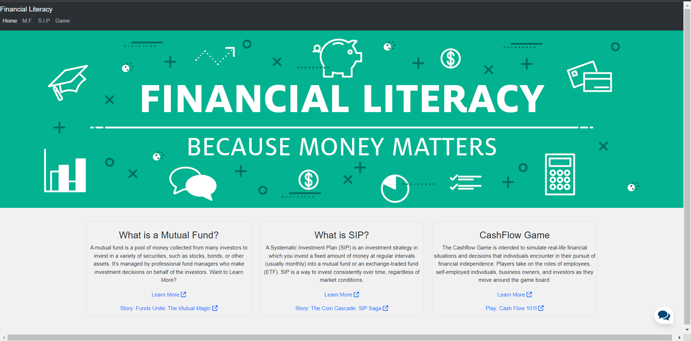
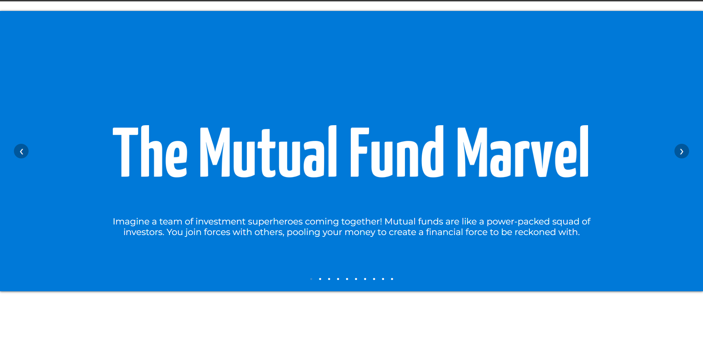
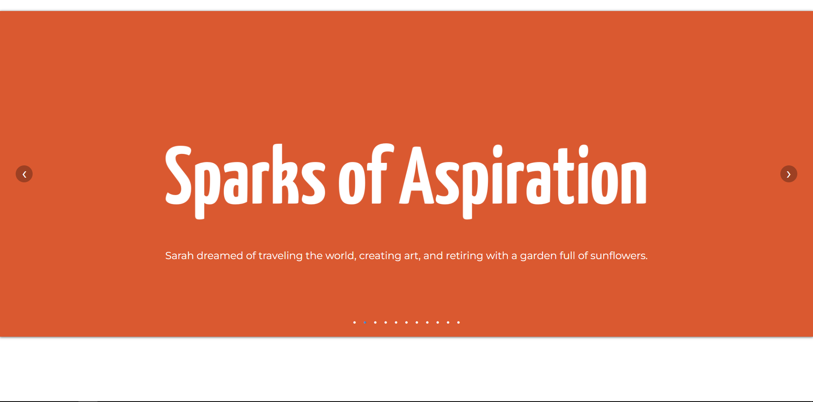
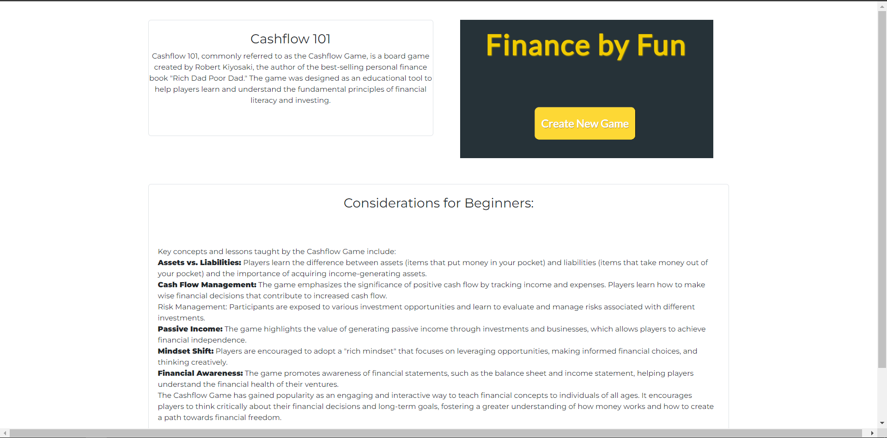
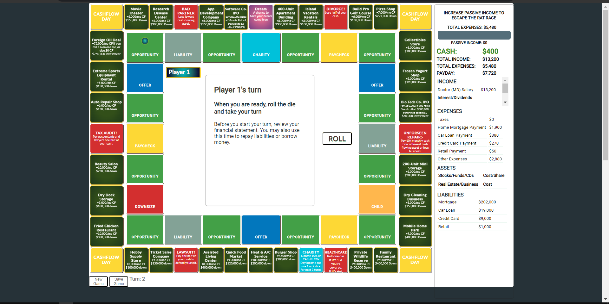
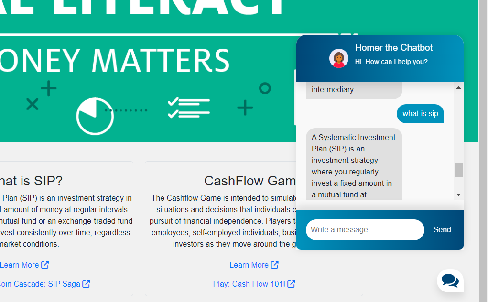

# BlackRock HackKnight 2023

This project is built using Python, Flask, HTMl, CSS, Javascript, and Natural Language Processing (NLTK). It includes some basic neural networks for processing updated data (.json format) to train the chatbot to update its responses. 

## Demonstration 










### Initial Setup:

Create a virtual environment
```
$ python3 -m venv venv
$ .venv\scripts\activate
```
Install dependencies
```
$ (venv) pip install Flask torch torchvision nltk flask-cors
```
Install nltk package
```
$ (venv) python
>>> import nltk
>>> nltk.download('punkt')
```
Modify `intents.json` with different intents and responses for your Chatbot

This will dump data.pth file. And then run
the following command to test it in the console.
```
$ (venv) python train.py
$ (venv) python chat.py
```
Run
```
$ (venv) python -m flask run
```

**Helpful Links:**
Trouble with virtual environments: https://code.visualstudio.com/docs/python/tutorial-flask
